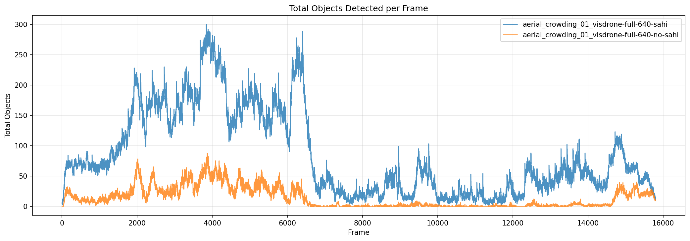
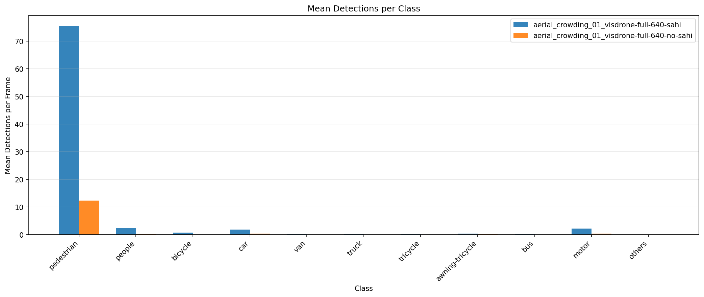
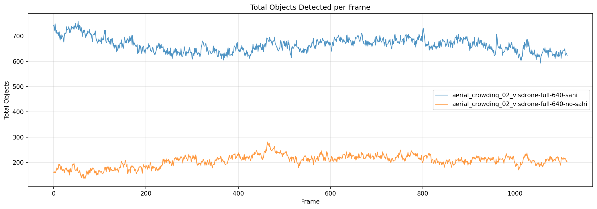
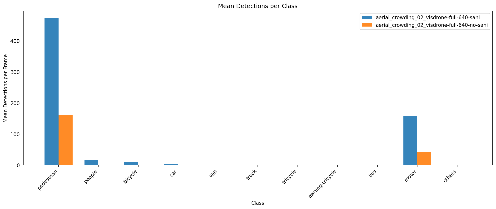
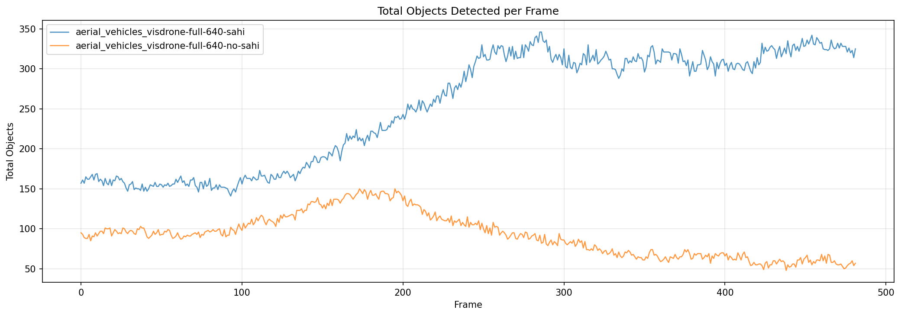
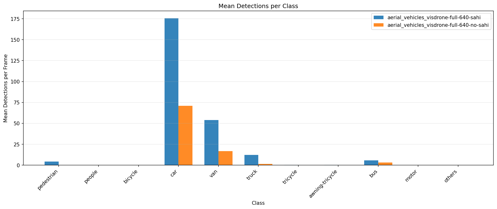

# DeepStream SAHI

[](https://www.apache.org/licenses/LICENSE-2.0)
[](https://developer.nvidia.com/deepstream-sdk)
[](https://developer.nvidia.com/tensorrt)

GStreamer plugins that bring [SAHI](https://github.com/obss/sahi) slicing to NVIDIA DeepStream. The project keeps slicing, inference, and merge steps inside the DeepStream pipeline, using `nvinfer` for TensorRT execution and `NvDsObjectMeta` for post-processing.

## Overview

This repository provides two plugins:

- `nvsahipreprocess`: computes frame slices, crops them on GPU, and prepares the input for `nvinfer`
- `nvsahipostprocess`: merges overlapping detections produced at slice boundaries using GreedyNMM

Typical pipeline:

```text
nvstreammux -> nvsahipreprocess -> nvinfer -> nvsahipostprocess -> nvtracker -> nvdsosd
```

## Architecture

Most SAHI integrations around DeepStream run outside the pipeline, often in Python. This project keeps the workflow inside GStreamer so it can work with standard DeepStream components such as tracking, analytics, message brokers, and display elements.

Key points:

- SAHI slicing implemented as DeepStream plugins
- TensorRT inference handled by `nvinfer`
- Support for DeepStream 8.x and 9.x
- Test scripts and sample models included in the repository

## Compatibility

| Component | DeepStream 8.0 | DeepStream 9.0 |
|-----------|----------------|----------------|
| DeepStream SDK | 8.0 | 9.0 |
| CUDA Toolkit | 12.8 | 13.1 |
| TensorRT | 10.9.0 | 10.14.1 |
| GStreamer | 1.24.2 | 1.24.2 |
| Python bindings | `pyds 1.2.2` | built from source |

The `install.sh` script detects the installed DeepStream version and selects the matching sources.

## Quick Start

This repository uses [Git LFS](https://git-lfs.com/) for ONNX model files.

```bash
git lfs install
git clone https://github.com/levipereira/deepstream-sahi.git
cd deepstream-sahi
```

Run a DeepStream container:

```bash
docker run -it --name deepstream-sahi --net=host --gpus all \
    -v `pwd`:/apps/deepstream-sahi \
    -w /apps/deepstream-sahi \
    nvcr.io/nvidia/deepstream:9.0-triton-multiarch
```

Inside the container:

```bash
/apps/deepstream-sahi/install.sh
source /opt/nvidia/deepstream/deepstream/sources/deepstream_python_apps/pyds/bin/activate
cd /apps/deepstream-sahi/python_test/deepstream-test-sahi
python3 deepstream_test_sahi.py --model visdrone-full-640 --no-display --csv -i ../videos/aerial_crowding_01.mp4
```

Test videos are available on [Google Drive](https://drive.google.com/drive/folders/1CRLnuH9AtTwmxRz7z-Mtu6ErKx__VMK4) and should be placed in `python_test/videos/`.

For container variants, display notes, rebuild mode, and environment details, see `docs/INSTALL.md`.

## Documentation

| Document | Description |
|----------|-------------|
| [Installation Guide](docs/INSTALL.md) | container setup, dependencies, plugin build |
| [Usage Guide](docs/USAGE.md) | pipeline execution, CLI arguments, result comparison |
| [Plugin Reference](docs/PLUGINS.md) | plugin properties and behavior |
| [Training Guide](docs/TRAINING.md) | training workflow for sliced models |
| [Test Results](docs/TEST_RESULTS.md) | evaluation data and charts |
| [Parameter Tests — Vehicles](docs/PARAMETER_TESTS.md) | postprocess parameter validation (moderate density) |
| [Parameter Tests — Dense Crowd](docs/PARAMETER_TESTS_CROWDING.md) | postprocess parameter validation (high density) |

## Repository Structure

```text
deepstream-sahi/
├── deepstream_source/
│   ├── gst-plugins/
│   │   ├── gst-nvsahipreprocess/
│   │   └── gst-nvsahipostprocess/
│   └── libs/
│       ├── nvdsinfer_8.0/
│       ├── nvdsinfer_9.0/
│       └── nvdsinfer_yolo/
├── python_test/
│   ├── common/
│   ├── deepstream-test-sahi/
│   └── videos/
├── train_yolov9_visdrone/
├── test_results/
├── scripts/
│   └── test_postprocess_params.sh
├── docs/
├── install.sh
└── README.md
```

## Included Components

### `nvsahipreprocess`

- computes slice windows for each frame
- crops and rescales slices with `NvBufSurfTransform`
- forwards the resulting data to `nvinfer`

### `nvsahipostprocess` (v1.2)

- reads detections from `NvDsObjectMeta`
- merges duplicates created by overlapping slices using a two-phase GreedyNMM algorithm
- supports IoU and IoS based matching with spatial hash grid indexing
- merges instance-segmentation masks (element-wise maximum)
- supports multiple GIE targeting (`gie-ids="1;3;5"`)
- parallel per-frame processing via OpenMP
- configurable merge strategy (union / weighted / largest)

### `nvdsinfer`

The repository includes version-specific `nvdsinfer` sources under `deepstream_source/libs/nvdsinfer_8.0/` and `deepstream_source/libs/nvdsinfer_9.0/`.

The modified implementation adds engine naming and lookup logic to avoid rebuilding TensorRT engines unnecessarily. The generated name follows this format:

```text
{model}_b{batch}_i{W}x{H}_{compute_cap}_{gpu}_{trt_ver}_{precision}.engine
```

### `nvdsinfer_yolo`

Custom parsing functions for YOLO models exported with `EfficientNMS_TRT` and `EfficientNMSX_TRT + ROIAlign_TRT`.

## Results Summary

Test setup:

- input video resolution: `2560x1440`
- GPU: `NVIDIA RTX 5080`
- precision: `FP16`
- batch size: `16`

### Detection Counts Per Frame

#### `visdrone-full-640`

| Video | No SAHI | SAHI | Change |
|-------|---------|------|--------|
| `aerial_crowding_01` | 13.8 | 84.2 | +510% |
| `aerial_crowding_02` | 206.2 | 664.7 | +222% |
| `aerial_vehicles` | 92.3 | 252.5 | +174% |

#### `visdrone-sliced-448`

| Video | No SAHI | SAHI | Change |
|-------|---------|------|--------|
| `aerial_crowding_01` | 2.3 | 85.3 | +3619% |
| `aerial_crowding_02` | 35.9 | 614.9 | +1613% |
| `aerial_vehicles` | 28.6 | 226.7 | +694% |

### Full-Frame Training vs Sliced Training With SAHI

| Video | `full-640 + SAHI` | `sliced-448 + SAHI` | Difference |
|-------|-------------------|---------------------|------------|
| `aerial_crowding_01` | 84.2 | 85.3 | +1.3% |
| `aerial_crowding_02` | 664.7 | 614.9 | -7.5% |
| `aerial_vehicles` | 252.5 | 226.7 | -10.2% |

For the complete benchmark, see `docs/TEST_RESULTS.md`.

### Example Charts

#### Dense Pedestrian Crowd

<p align="center">
  
</p>
<p align="center">
  
</p>

#### Very Dense Crowd

<p align="center">
  
</p>
<p align="center">
  
</p>

#### Dense Vehicle Traffic

<p align="center">
  
</p>
<p align="center">
  
</p>

### Video Demos

| Dense Pedestrian Crowd | Very Dense Crowd | Dense Vehicle Traffic |
|:---:|:---:|:---:|
| [](https://www.youtube.com/watch?v=_W_wBDvpzzY&list=PLJMGcwo73q30LtZaCw1VQ7UGPvGsmVlco) | [](https://www.youtube.com/watch?v=RFX8hIWscgw&list=PLJMGcwo73q33YfssoIGBIMu51EPJBobxf) | [](https://www.youtube.com/watch?v=3CxEp90Jy60&list=PLJMGcwo73q33HWQfjHUD_exEVOUSnlbsA) |

## Training Notes

The repository includes both full-frame and slice-oriented training artifacts. The current results indicate that SAHI allows smaller model inputs to recover object scale on high-resolution video, which can help balance accuracy and throughput.

Training details are documented in `docs/TRAINING.md`.

## Plugin Parameter Validation

All `nvsahipostprocess` parameters have been validated with automated tests across two
density regimes:

| Video | Detections/frame | Scene | Tests |
|-------|-----------------|-------|-------|
| `aerial_vehicles.mp4` | ~311 | Moderate — vehicles | 21/21 passed |
| `aerial_crowding_02.mp4` | ~1312 | Very dense — pedestrians + motorcycles | 21/21 passed |

Key findings:

- **match-metric**: IoS suppresses more duplicates than IoU (recommended for SAHI)
- **match-threshold**: monotonic — lower threshold → more aggressive suppression
- **class-agnostic=true**: +36% more suppression on vehicles, +13% on dense crowds
- **enable-merge=false**: reliably produces zero merges (pure NMS mode)
- **max-detections**: exact cap — removes 789 extra detections in dense scenes
- **PERF profiling**: `GST_DEBUG=nvsahipostprocess:4` shows latency summary every ~1s

### Pipeline Throughput (RTX 5080, FP16, 9 slices/frame, 2560×1440)

| Video | Dets/frame | Pipeline FPS | Postprocess ms/frame | Postprocess overhead |
|-------|-----------|-------------|---------------------|---------------------|
| `aerial_vehicles` | ~311 | **29.9 fps** | 0.35 ms | 1.0% |
| `aerial_crowding_02` | ~1,312 | **24.4 fps** | 1.55 ms | 3.8% |

The postprocess NMM is never the bottleneck — TensorRT inference on 9 slices dominates.
At 4× more detections, postprocess latency scales sub-linearly (spatial grid indexing).

Run the automated test suite:

```bash
# Default video (aerial_vehicles.mp4)
scripts/test_postprocess_params.sh

# Custom video
scripts/test_postprocess_params.sh python_test/videos/aerial_crowding_02.mp4
```

Full results: [Parameter Tests — Vehicles](docs/PARAMETER_TESTS.md) |
[Parameter Tests — Dense Crowd](docs/PARAMETER_TESTS_CROWDING.md)

## Limitations

- The bidirectional NMM algorithm (non-greedy, transitive merge chains) is not implemented. GreedyNMM covers real-time use-cases adequately.
- Merged mask resolution is capped at 512x512 to prevent excessive memory allocation.
- Only single-source pipelines have been validated end-to-end; multi-source is supported via OpenMP parallelism but has not been benchmarked.

See `docs/PLUGINS.md` for the full property reference and algorithm details.

## License

- `gst-nvsahipostprocess`: [Apache-2.0](https://www.apache.org/licenses/LICENSE-2.0)
- `gst-nvsahipreprocess`: [NVIDIA Proprietary](https://developer.nvidia.com/deepstream-eula)
- `nvdsinfer` and `nvdsinfer_yolo`: [NVIDIA Proprietary](https://developer.nvidia.com/deepstream-eula)
- `python_test/` scripts: [Apache-2.0](https://www.apache.org/licenses/LICENSE-2.0)
- `python_test/common/`: [Apache-2.0](https://www.apache.org/licenses/LICENSE-2.0)
