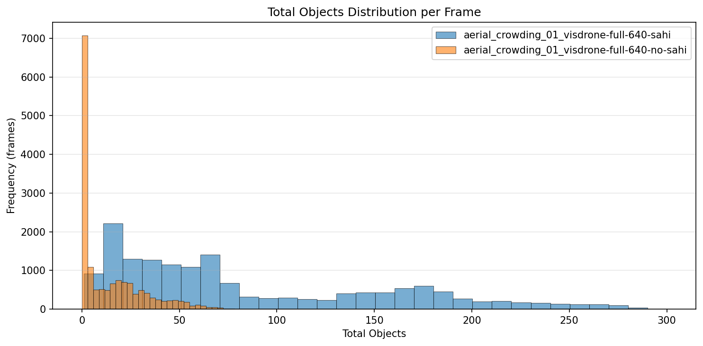
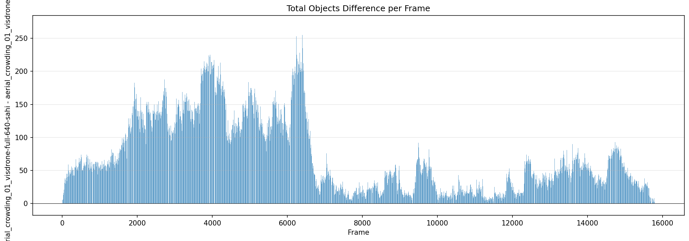
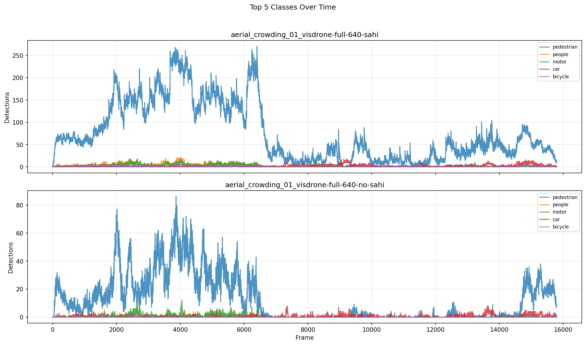

# Detection Comparison Report

**Generated:** 2026-03-18 21:24:27

## Overview

| | **aerial_crowding_01_visdrone-full-640-sahi** | **aerial_crowding_01_visdrone-full-640-no-sahi** |
|---|---|---|
| Frames analyzed | 15794 | 15794 |
| Mean objects/frame | 84.2 | 13.8 |
| Std deviation | 70.7 | 17.0 |
| Median objects/frame | 60 | 4 |
| Min objects/frame | 1 | 0 |
| Max objects/frame | 300 | 87 |

**Mean difference (aerial_crowding_01_visdrone-full-640-sahi - aerial_crowding_01_visdrone-full-640-no-sahi):** +70.4 objects/frame (+509.9%)

## Per-Class Mean Detections

| Class | **aerial_crowding_01_visdrone-full-640-sahi** | **aerial_crowding_01_visdrone-full-640-no-sahi** | Diff |
|---|---|---|---|
| pedestrian | 75.53 | 12.35 | +63.18 |
| people | 2.50 | 0.19 | +2.31 |
| bicycle | 0.80 | 0.07 | +0.73 |
| car | 1.89 | 0.44 | +1.45 |
| van | 0.30 | 0.06 | +0.24 |
| truck | 0.19 | 0.03 | +0.16 |
| tricycle | 0.20 | 0.03 | +0.18 |
| awning-tricycle | 0.33 | 0.19 | +0.14 |
| bus | 0.29 | 0.01 | +0.29 |
| motor | 2.18 | 0.43 | +1.74 |
| others | 0.01 | 0.00 | +0.01 |

## Charts

### Total Objects Detected per Frame

### Mean Detections per Class

### Total Objects Distribution

### Detection Difference per Frame

### Top Classes Over Time

