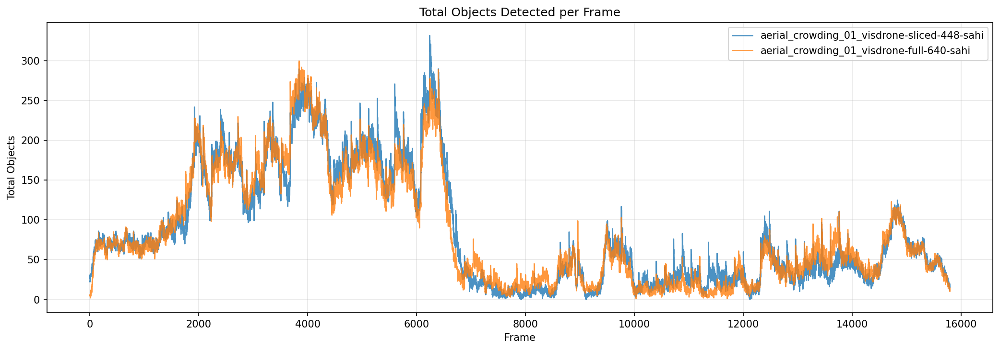
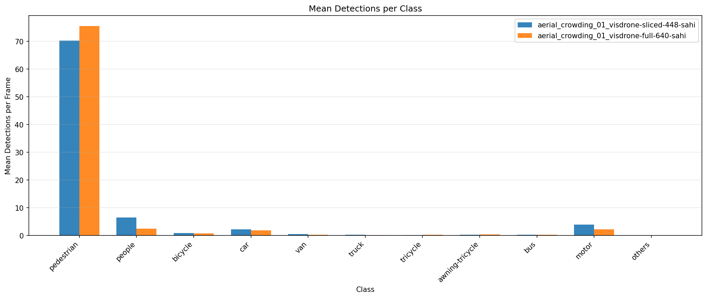
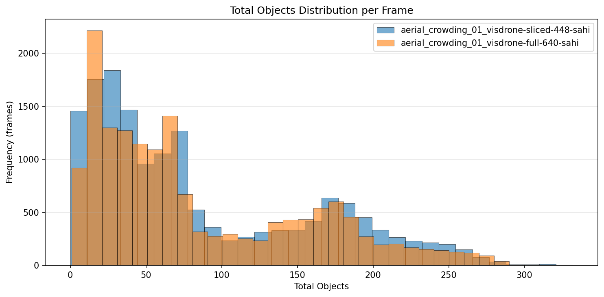
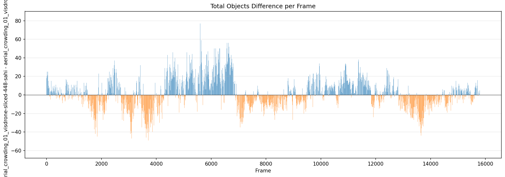
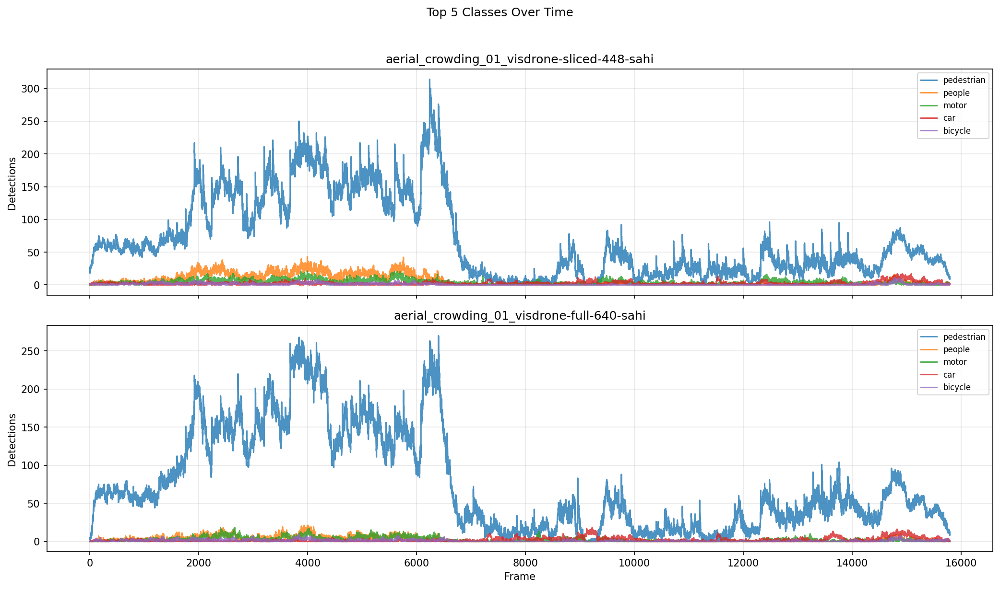

# Detection Comparison Report

**Generated:** 2026-03-18 21:32:37

## Overview

| | **aerial_crowding_01_visdrone-sliced-448-sahi** | **aerial_crowding_01_visdrone-full-640-sahi** |
|---|---|---|
| Frames analyzed | 15794 | 15794 |
| Mean objects/frame | 85.3 | 84.2 |
| Std deviation | 72.9 | 70.7 |
| Median objects/frame | 61 | 60 |
| Min objects/frame | 0 | 1 |
| Max objects/frame | 332 | 300 |

**Mean difference (aerial_crowding_01_visdrone-sliced-448-sahi - aerial_crowding_01_visdrone-full-640-sahi):** +1.1 objects/frame (+1.3%)

## Per-Class Mean Detections

| Class | **aerial_crowding_01_visdrone-sliced-448-sahi** | **aerial_crowding_01_visdrone-full-640-sahi** | Diff |
|---|---|---|---|
| pedestrian | 70.24 | 75.53 | -5.29 |
| people | 6.45 | 2.50 | +3.96 |
| bicycle | 0.91 | 0.80 | +0.11 |
| car | 2.23 | 1.89 | +0.34 |
| van | 0.46 | 0.30 | +0.15 |
| truck | 0.32 | 0.19 | +0.13 |
| tricycle | 0.20 | 0.20 | -0.01 |
| awning-tricycle | 0.24 | 0.33 | -0.09 |
| bus | 0.28 | 0.29 | -0.01 |
| motor | 3.96 | 2.18 | +1.79 |
| others | 0.01 | 0.01 | -0.00 |

## Charts

### Total Objects Detected per Frame

### Mean Detections per Class

### Total Objects Distribution

### Detection Difference per Frame

### Top Classes Over Time

