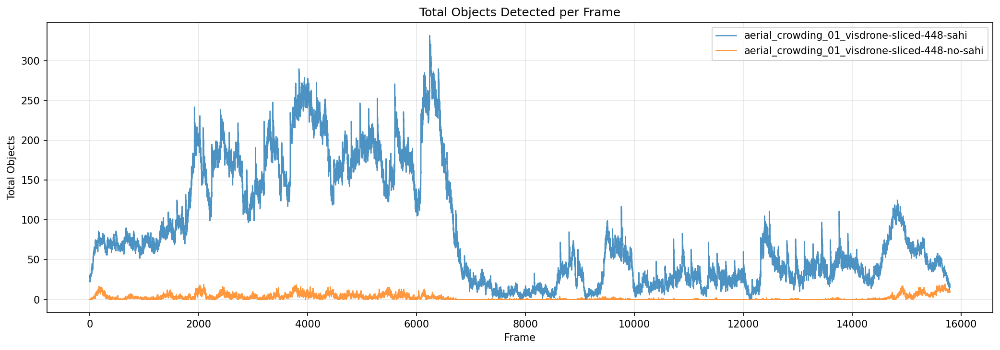
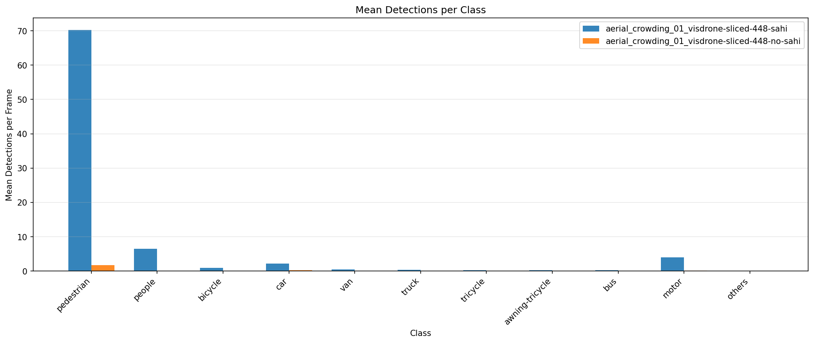
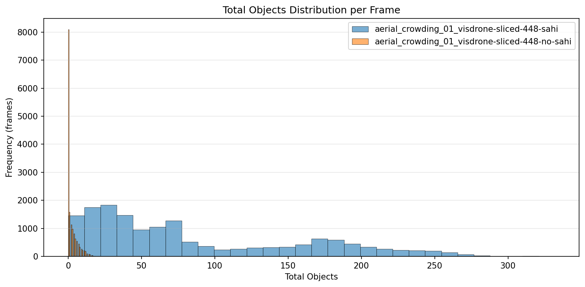
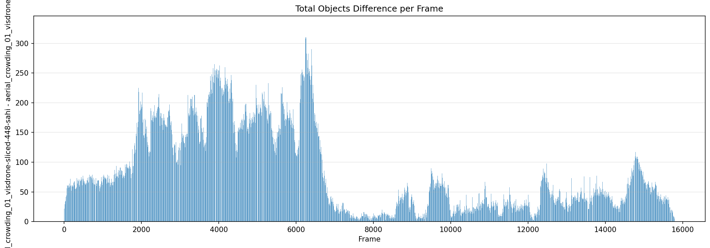
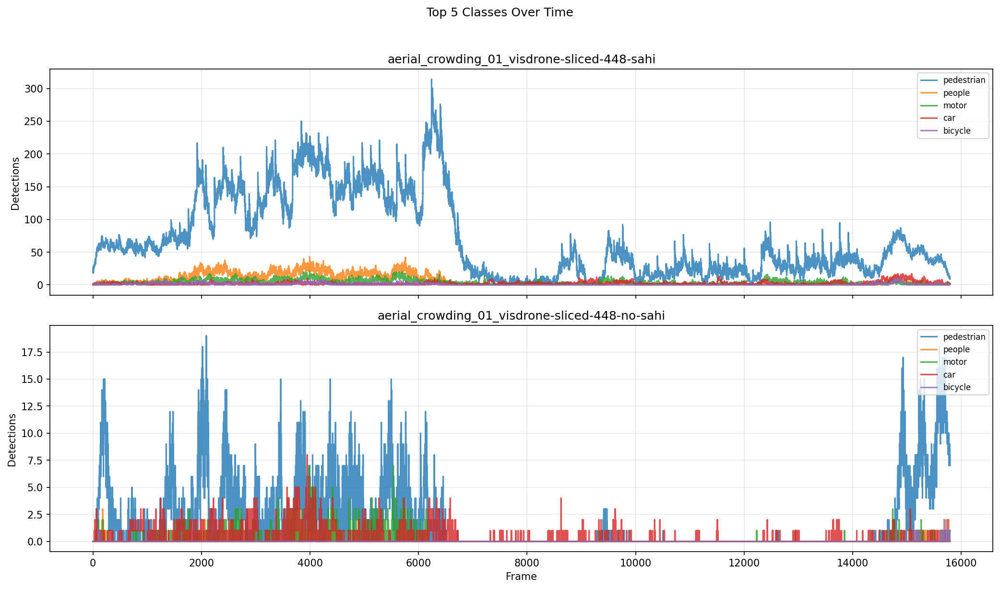

# Detection Comparison Report

**Generated:** 2026-03-18 21:29:14

## Overview

| | **aerial_crowding_01_visdrone-sliced-448-sahi** | **aerial_crowding_01_visdrone-sliced-448-no-sahi** |
|---|---|---|
| Frames analyzed | 15794 | 15794 |
| Mean objects/frame | 85.3 | 2.3 |
| Std deviation | 72.9 | 3.5 |
| Median objects/frame | 61 | 0 |
| Min objects/frame | 0 | 0 |
| Max objects/frame | 332 | 19 |

**Mean difference (aerial_crowding_01_visdrone-sliced-448-sahi - aerial_crowding_01_visdrone-sliced-448-no-sahi):** +83.0 objects/frame (+3619.2%)

## Per-Class Mean Detections

| Class | **aerial_crowding_01_visdrone-sliced-448-sahi** | **aerial_crowding_01_visdrone-sliced-448-no-sahi** | Diff |
|---|---|---|---|
| pedestrian | 70.24 | 1.71 | +68.53 |
| people | 6.45 | 0.02 | +6.43 |
| bicycle | 0.91 | 0.01 | +0.90 |
| car | 2.23 | 0.28 | +1.95 |
| van | 0.46 | 0.03 | +0.43 |
| truck | 0.32 | 0.02 | +0.30 |
| tricycle | 0.20 | 0.00 | +0.20 |
| awning-tricycle | 0.24 | 0.03 | +0.22 |
| bus | 0.28 | 0.01 | +0.28 |
| motor | 3.96 | 0.19 | +3.78 |
| others | 0.01 | 0.00 | +0.01 |

## Charts

### Total Objects Detected per Frame

### Mean Detections per Class

### Total Objects Distribution

### Detection Difference per Frame

### Top Classes Over Time

