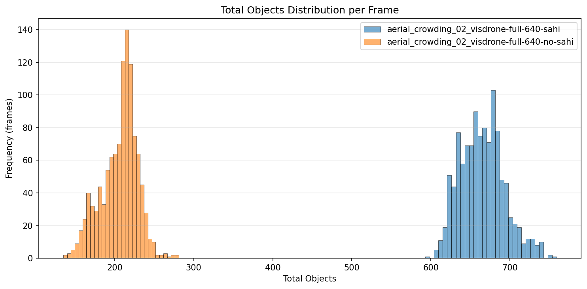
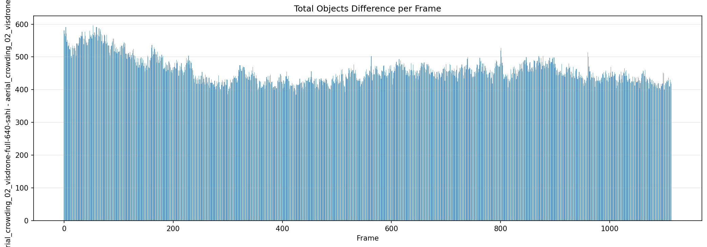
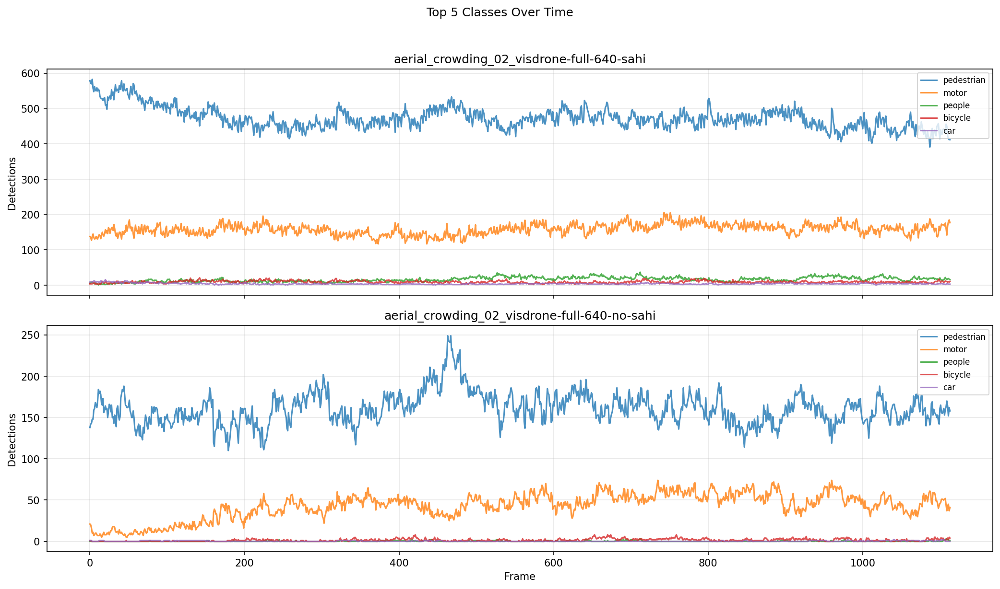

# Detection Comparison Report

**Generated:** 2026-03-18 23:18:28

## Overview

| | **aerial_crowding_02_visdrone-full-640-sahi** | **aerial_crowding_02_visdrone-full-640-no-sahi** |
|---|---|---|
| Frames analyzed | 1114 | 1114 |
| Mean objects/frame | 664.7 | 206.2 |
| Std deviation | 27.8 | 23.0 |
| Median objects/frame | 664 | 210 |
| Min objects/frame | 593 | 135 |
| Max objects/frame | 759 | 281 |

**Mean difference (aerial_crowding_02_visdrone-full-640-sahi - aerial_crowding_02_visdrone-full-640-no-sahi):** +458.6 objects/frame (+222.4%)

## Per-Class Mean Detections

| Class | **aerial_crowding_02_visdrone-full-640-sahi** | **aerial_crowding_02_visdrone-full-640-no-sahi** | Diff |
|---|---|---|---|
| pedestrian | 473.05 | 160.82 | +312.23 |
| people | 16.27 | 0.22 | +16.05 |
| bicycle | 9.35 | 1.49 | +7.86 |
| car | 4.13 | 0.24 | +3.90 |
| van | 0.27 | 0.02 | +0.25 |
| truck | 0.10 | 0.02 | +0.08 |
| tricycle | 1.66 | 0.26 | +1.40 |
| awning-tricycle | 1.57 | 0.05 | +1.53 |
| bus | 0.05 | 0.04 | +0.02 |
| motor | 158.18 | 43.05 | +115.14 |
| others | 0.09 | 0.00 | +0.09 |

## Charts

### Total Objects Detected per Frame

### Mean Detections per Class

### Total Objects Distribution

### Detection Difference per Frame

### Top Classes Over Time

