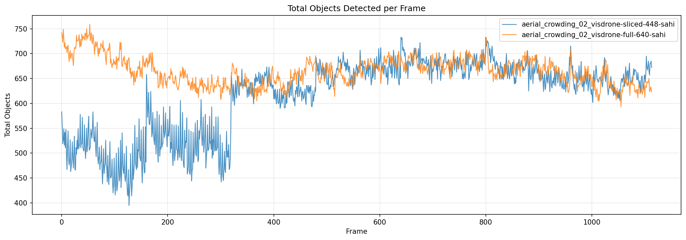
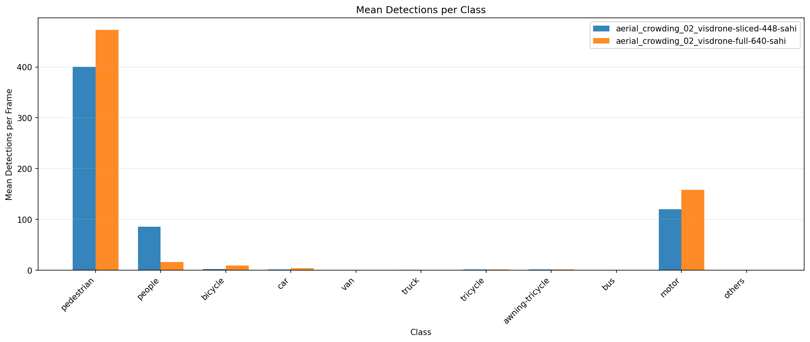
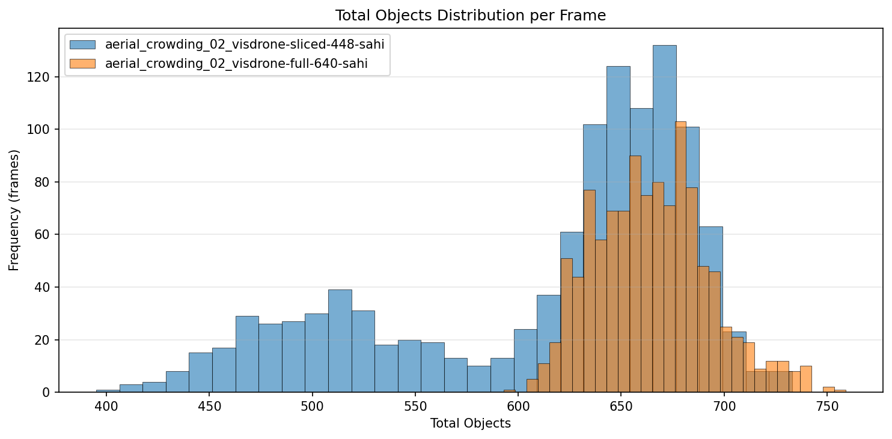
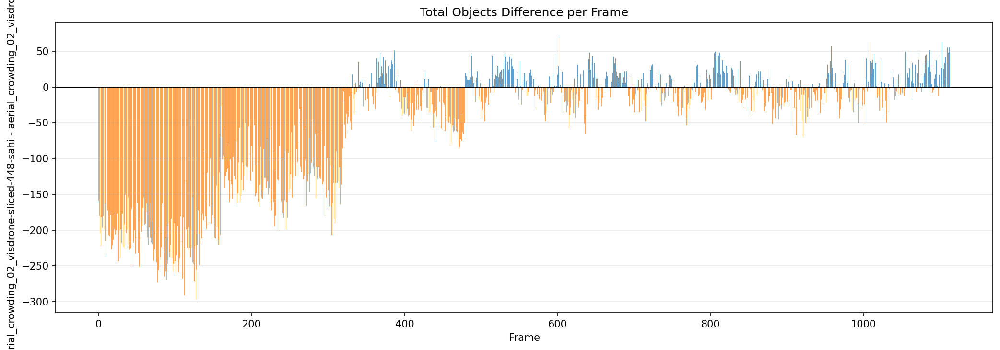
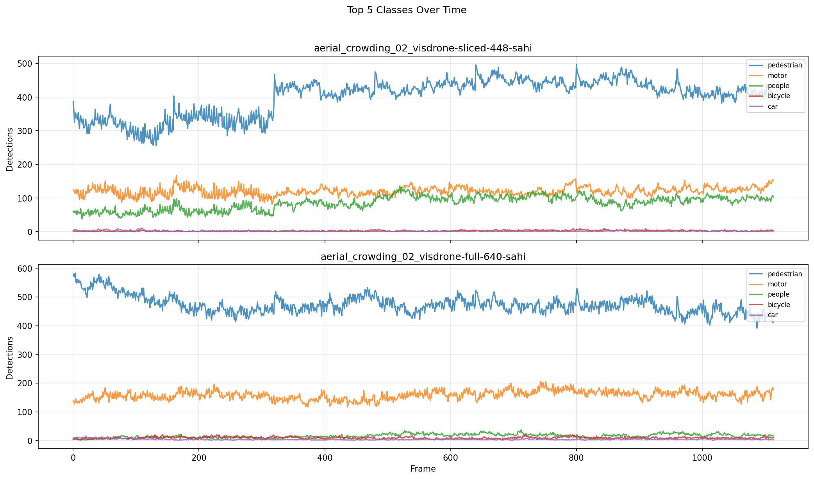

# Detection Comparison Report

**Generated:** 2026-03-18 23:18:39

## Overview

| | **aerial_crowding_02_visdrone-sliced-448-sahi** | **aerial_crowding_02_visdrone-full-640-sahi** |
|---|---|---|
| Frames analyzed | 1114 | 1114 |
| Mean objects/frame | 614.9 | 664.7 |
| Std deviation | 75.5 | 27.8 |
| Median objects/frame | 644 | 664 |
| Min objects/frame | 395 | 593 |
| Max objects/frame | 733 | 759 |

**Mean difference (aerial_crowding_02_visdrone-sliced-448-sahi - aerial_crowding_02_visdrone-full-640-sahi):** -49.9 objects/frame (-7.5%)

## Per-Class Mean Detections

| Class | **aerial_crowding_02_visdrone-sliced-448-sahi** | **aerial_crowding_02_visdrone-full-640-sahi** | Diff |
|---|---|---|---|
| pedestrian | 400.68 | 473.05 | -72.37 |
| people | 85.65 | 16.27 | +69.38 |
| bicycle | 2.48 | 9.35 | -6.87 |
| car | 1.77 | 4.13 | -2.37 |
| van | 0.43 | 0.27 | +0.16 |
| truck | 0.57 | 0.10 | +0.46 |
| tricycle | 1.33 | 1.66 | -0.33 |
| awning-tricycle | 1.63 | 1.57 | +0.05 |
| bus | 0.06 | 0.05 | +0.00 |
| motor | 120.28 | 158.18 | -37.91 |
| others | 0.00 | 0.09 | -0.09 |

## Charts

### Total Objects Detected per Frame

### Mean Detections per Class

### Total Objects Distribution

### Detection Difference per Frame

### Top Classes Over Time

