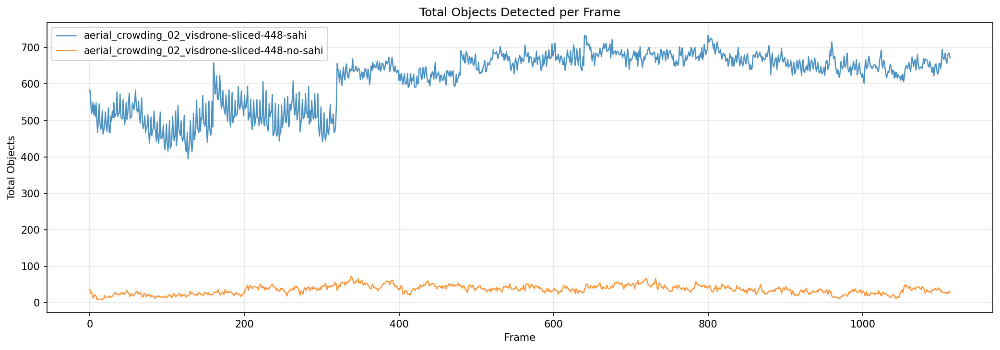
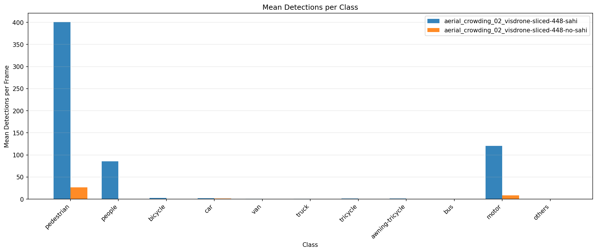
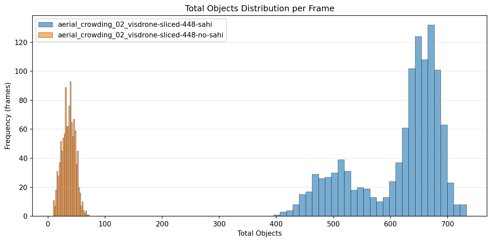
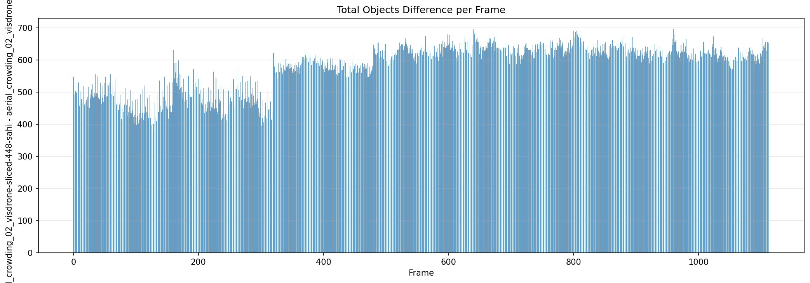
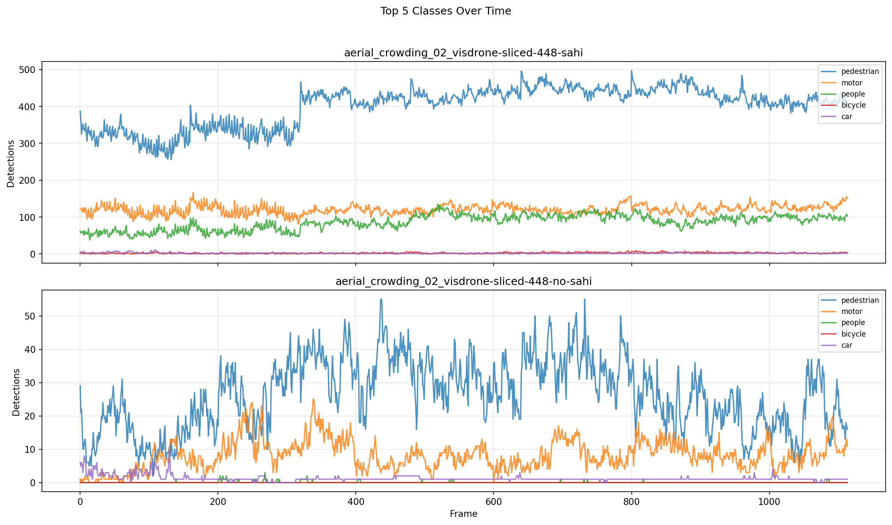

# Detection Comparison Report

**Generated:** 2026-03-18 23:18:34

## Overview

| | **aerial_crowding_02_visdrone-sliced-448-sahi** | **aerial_crowding_02_visdrone-sliced-448-no-sahi** |
|---|---|---|
| Frames analyzed | 1114 | 1114 |
| Mean objects/frame | 614.9 | 35.9 |
| Std deviation | 75.5 | 11.5 |
| Median objects/frame | 644 | 37 |
| Min objects/frame | 395 | 9 |
| Max objects/frame | 733 | 72 |

**Mean difference (aerial_crowding_02_visdrone-sliced-448-sahi - aerial_crowding_02_visdrone-sliced-448-no-sahi):** +579.0 objects/frame (+1613.2%)

## Per-Class Mean Detections

| Class | **aerial_crowding_02_visdrone-sliced-448-sahi** | **aerial_crowding_02_visdrone-sliced-448-no-sahi** | Diff |
|---|---|---|---|
| pedestrian | 400.68 | 26.32 | +374.36 |
| people | 85.65 | 0.05 | +85.59 |
| bicycle | 2.48 | 0.00 | +2.48 |
| car | 1.77 | 1.25 | +0.51 |
| van | 0.43 | 0.00 | +0.43 |
| truck | 0.57 | 0.02 | +0.55 |
| tricycle | 1.33 | 0.00 | +1.33 |
| awning-tricycle | 1.63 | 0.00 | +1.63 |
| bus | 0.06 | 0.01 | +0.05 |
| motor | 120.28 | 8.23 | +112.04 |
| others | 0.00 | 0.00 | +0.00 |

## Charts

### Total Objects Detected per Frame

### Mean Detections per Class

### Total Objects Distribution

### Detection Difference per Frame

### Top Classes Over Time

