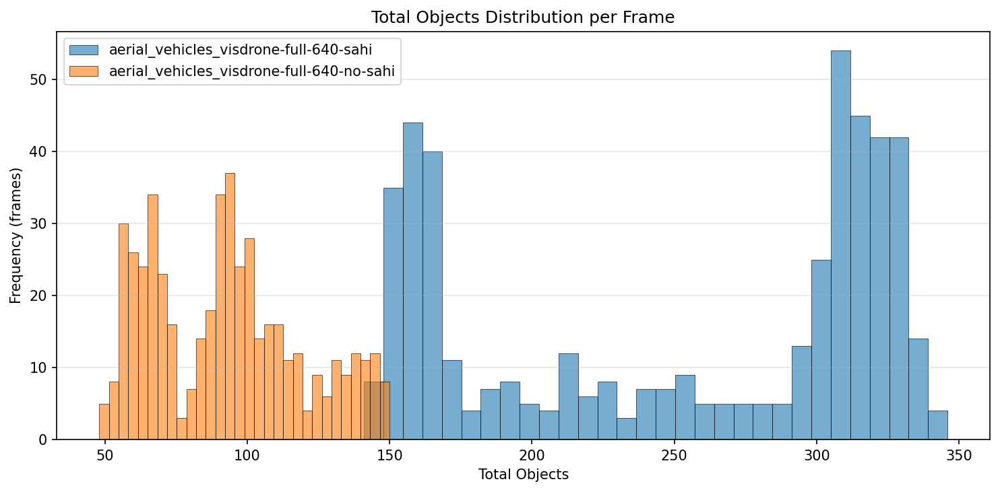
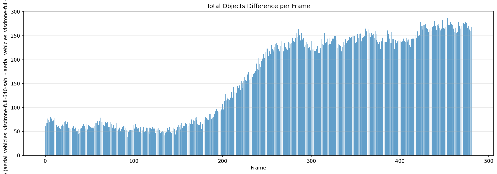
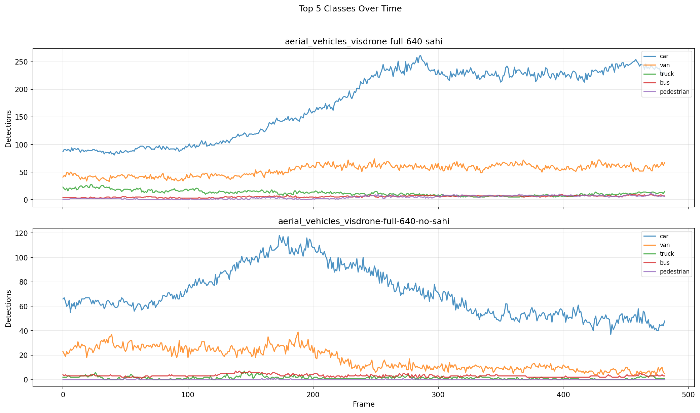

# Detection Comparison Report

**Generated:** 2026-03-18 23:18:46

## Overview

| | **aerial_vehicles_visdrone-full-640-sahi** | **aerial_vehicles_visdrone-full-640-no-sahi** |
|---|---|---|
| Frames analyzed | 482 | 482 |
| Mean objects/frame | 252.5 | 92.3 |
| Std deviation | 70.5 | 26.5 |
| Median objects/frame | 290 | 92 |
| Min objects/frame | 141 | 48 |
| Max objects/frame | 346 | 150 |

**Mean difference (aerial_vehicles_visdrone-full-640-sahi - aerial_vehicles_visdrone-full-640-no-sahi):** +160.3 objects/frame (+173.7%)

## Per-Class Mean Detections

| Class | **aerial_vehicles_visdrone-full-640-sahi** | **aerial_vehicles_visdrone-full-640-no-sahi** | Diff |
|---|---|---|---|
| pedestrian | 4.34 | 0.04 | +4.30 |
| people | 0.00 | 0.00 | +0.00 |
| bicycle | 0.04 | 0.00 | +0.04 |
| car | 175.59 | 70.81 | +104.78 |
| van | 53.88 | 16.81 | +37.07 |
| truck | 12.22 | 1.43 | +10.79 |
| tricycle | 0.19 | 0.00 | +0.19 |
| awning-tricycle | 0.31 | 0.00 | +0.31 |
| bus | 5.83 | 3.16 | +2.67 |
| motor | 0.01 | 0.01 | +0.01 |
| others | 0.11 | 0.00 | +0.11 |

## Charts

### Total Objects Detected per Frame

### Mean Detections per Class

### Total Objects Distribution

### Detection Difference per Frame

### Top Classes Over Time

