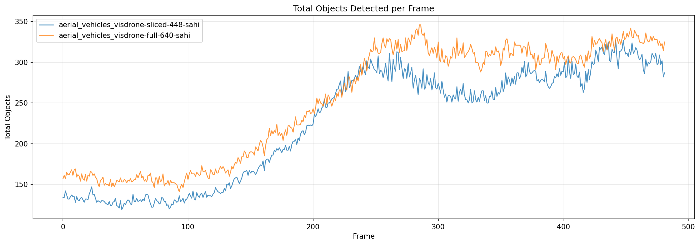
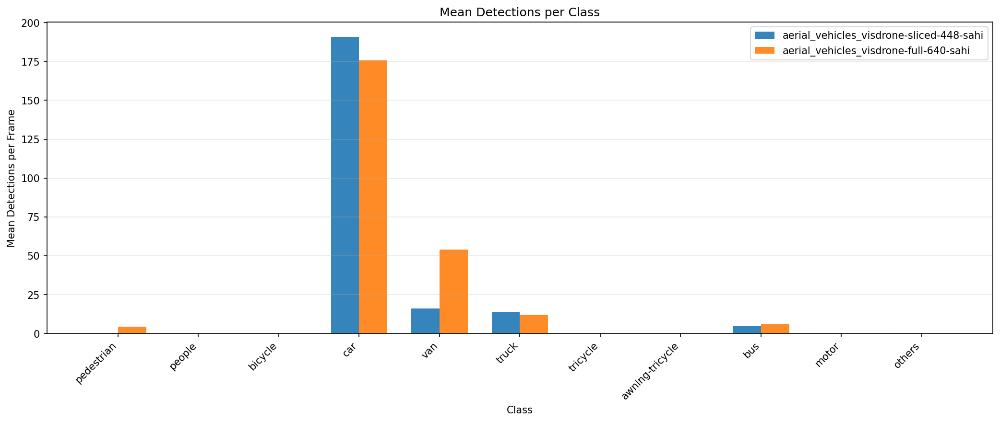
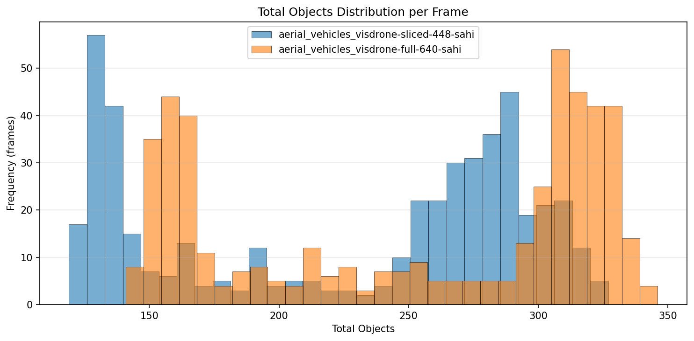
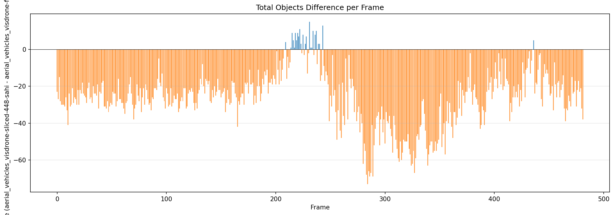
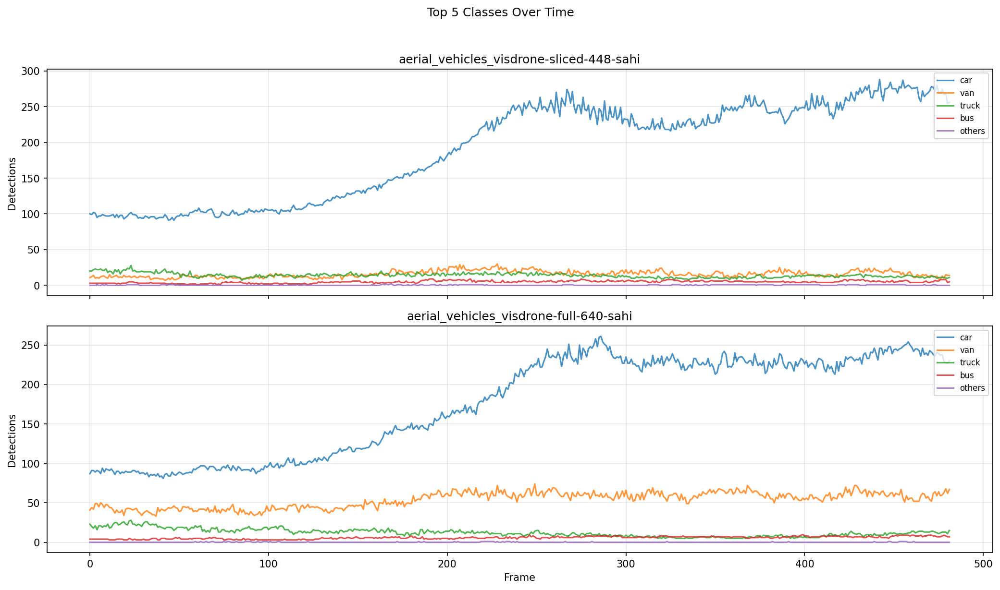

# Detection Comparison Report

**Generated:** 2026-03-18 23:18:52

## Overview

| | **aerial_vehicles_visdrone-sliced-448-sahi** | **aerial_vehicles_visdrone-full-640-sahi** |
|---|---|---|
| Frames analyzed | 482 | 482 |
| Mean objects/frame | 226.7 | 252.5 |
| Std deviation | 69.4 | 70.5 |
| Median objects/frame | 258 | 290 |
| Min objects/frame | 119 | 141 |
| Max objects/frame | 327 | 346 |

**Mean difference (aerial_vehicles_visdrone-sliced-448-sahi - aerial_vehicles_visdrone-full-640-sahi):** -25.9 objects/frame (-10.2%)

## Per-Class Mean Detections

| Class | **aerial_vehicles_visdrone-sliced-448-sahi** | **aerial_vehicles_visdrone-full-640-sahi** | Diff |
|---|---|---|---|
| pedestrian | 0.31 | 4.34 | -4.03 |
| people | 0.03 | 0.00 | +0.03 |
| bicycle | 0.00 | 0.04 | -0.04 |
| car | 190.85 | 175.59 | +15.26 |
| van | 15.92 | 53.88 | -37.95 |
| truck | 13.96 | 12.22 | +1.75 |
| tricycle | 0.07 | 0.19 | -0.12 |
| awning-tricycle | 0.06 | 0.31 | -0.25 |
| bus | 4.81 | 5.83 | -1.02 |
| motor | 0.28 | 0.01 | +0.26 |
| others | 0.37 | 0.11 | +0.25 |

## Charts

### Total Objects Detected per Frame

### Mean Detections per Class

### Total Objects Distribution

### Detection Difference per Frame

### Top Classes Over Time

