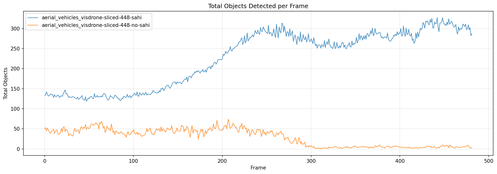
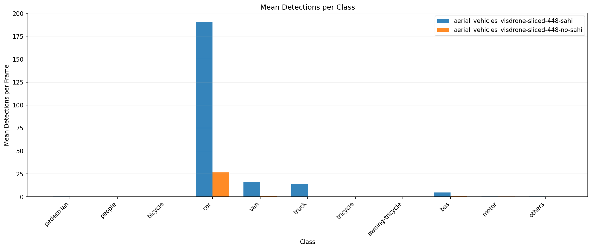
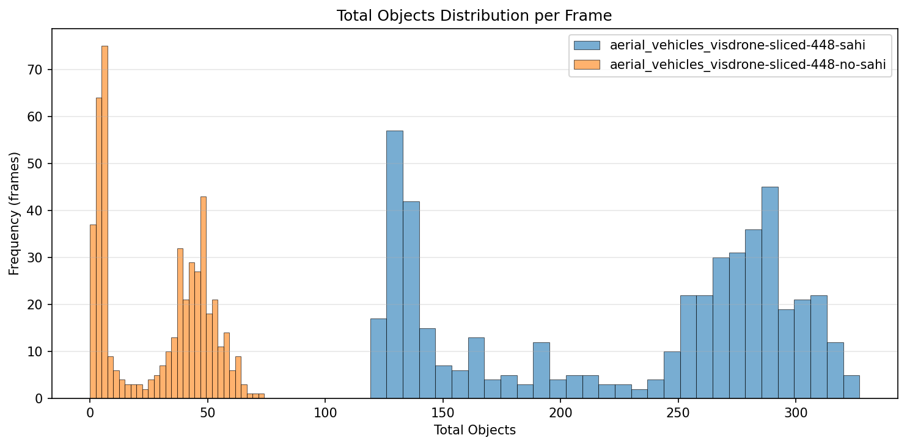
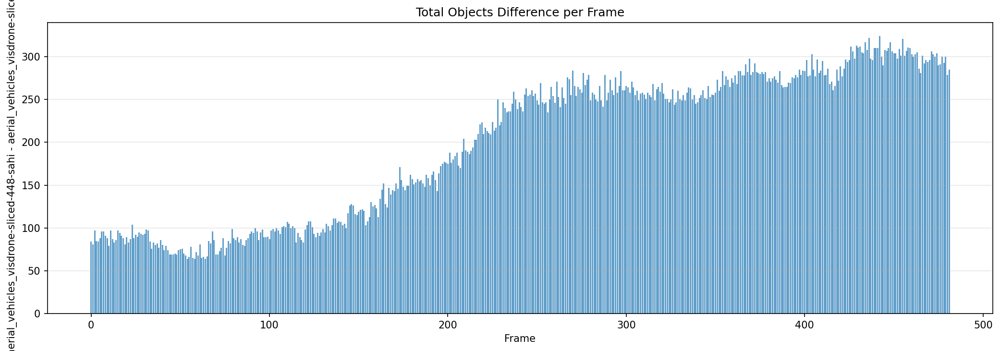
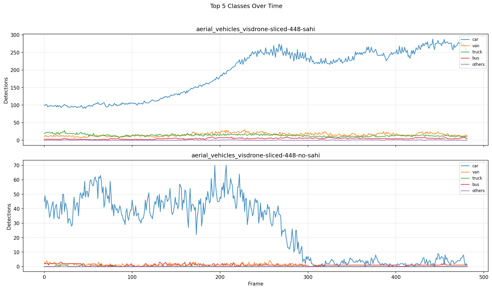

# Detection Comparison Report

**Generated:** 2026-03-18 23:18:49

## Overview

| | **aerial_vehicles_visdrone-sliced-448-sahi** | **aerial_vehicles_visdrone-sliced-448-no-sahi** |
|---|---|---|
| Frames analyzed | 482 | 482 |
| Mean objects/frame | 226.7 | 28.6 |
| Std deviation | 69.4 | 21.3 |
| Median objects/frame | 258 | 36 |
| Min objects/frame | 119 | 0 |
| Max objects/frame | 327 | 74 |

**Mean difference (aerial_vehicles_visdrone-sliced-448-sahi - aerial_vehicles_visdrone-sliced-448-no-sahi):** +198.1 objects/frame (+693.6%)

## Per-Class Mean Detections

| Class | **aerial_vehicles_visdrone-sliced-448-sahi** | **aerial_vehicles_visdrone-sliced-448-no-sahi** | Diff |
|---|---|---|---|
| pedestrian | 0.31 | 0.03 | +0.28 |
| people | 0.03 | 0.00 | +0.03 |
| bicycle | 0.00 | 0.00 | +0.00 |
| car | 190.85 | 26.43 | +164.42 |
| van | 15.92 | 0.68 | +15.24 |
| truck | 13.96 | 0.06 | +13.90 |
| tricycle | 0.07 | 0.00 | +0.07 |
| awning-tricycle | 0.06 | 0.00 | +0.06 |
| bus | 4.81 | 1.07 | +3.74 |
| motor | 0.28 | 0.29 | -0.02 |
| others | 0.37 | 0.00 | +0.37 |

## Charts

### Total Objects Detected per Frame

### Mean Detections per Class

### Total Objects Distribution

### Detection Difference per Frame

### Top Classes Over Time

